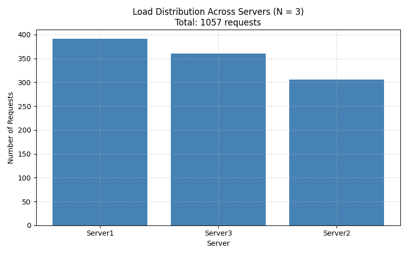
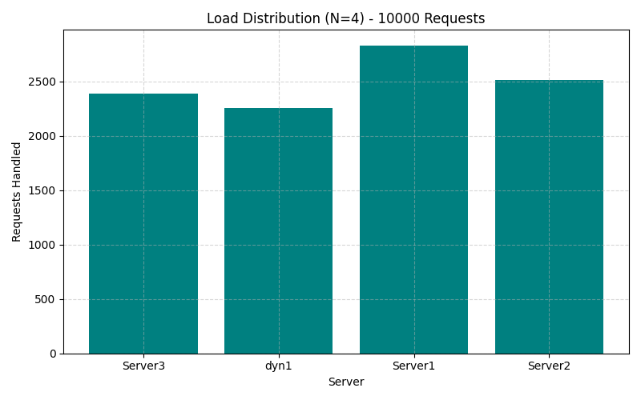
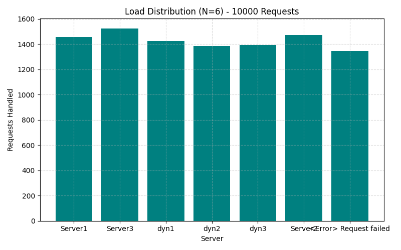
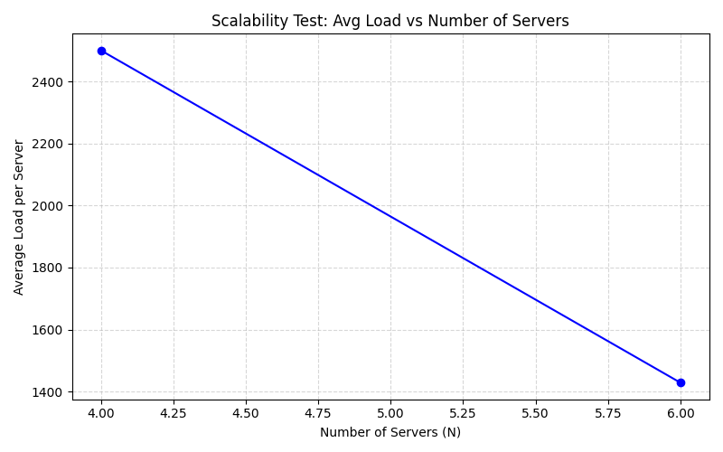
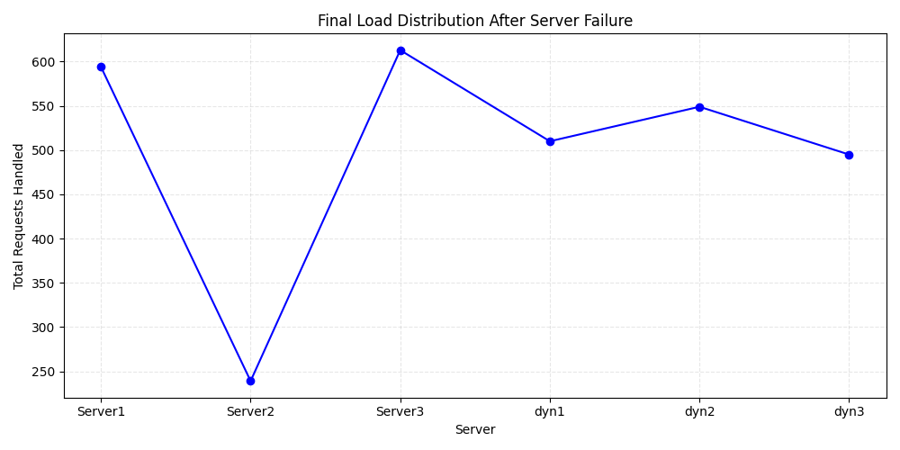

# Distributed Load Balancer with Consistent Hashing

This project implements a lightweight **distributed load balancer** using **Flask**, **Docker**, and a custom-built **consistent hashing** algorithm. It dynamically manages backend servers, automatically redistributes traffic on scaling events, and ensures fault tolerance with runtime container management.

---

## Project Overview

The load balancer system is designed to:

- Simulate **multiple backend replicas** (e.g., Server1, Server2, Server3)
- Use **consistent hashing** to distribute requests with minimal remapping
- Dynamically **add and remove containers** using API endpoints
- Provide **load recovery** by detecting failures and redistributing traffic
- Support **asynchronous request testing** to analyze performance
- Be fully containerized using Docker and orchestrated via Compose

---

## Installation & Setup

### Prerequisites

- Docker
- Docker Compose
- Python 3.8+ (for analysis scripts)
- WSL, Git Bash, or Linux shell (for Makefile support)

### Build & Run the System

1. **Clone the repo**

```bash
git clone https://github.com/DaniellaIseu/LoadBalancingProject.git

cd LoadBalancingProject
```

2. **Build all images (first-time only or after code changes):**

```bash
make build
```

3. **Start all containers in the background:**

```bash
make up
```

4. **Verify running containers:**

```bash
make ps
```

### Try the System (API Shortcuts)

* **Add dynamic servers (e.g., Server4 & Server5):**

```bash
make add
```

* **Remove dynamic servers (e.g., Server4 & Server5):**

```bash
make rm
```

* **Test request routing to `/home`:**

```bash
make route
```

* **Check the following endpoints in your browser:**

   * `http://localhost:5050/rep` — View active replicas
   * `http://localhost:5050/home` — Confirm routing to a backend
   * `http://localhost:5050/heartbeat` — Check health of routed server

## Usage & API Endpoints

Once the system is up, it's reachable via `http://localhost:5050`.

| Method | Endpoint | Description |
|--------|----------|-------------|
| GET | `/rep` | View current active replica servers |
| POST | `/add` | Add new servers (accepts custom hostnames) |
| DELETE | `/rm` | Remove servers dynamically |
| GET | `/home` | Sample route on backend servers |
| GET | `/heartbeat` | Check server availability |

## Makefile Shortcuts

```bash
make build      # Build all containers using cache
make rebuild    # Rebuild from scratch without using cache
make up         # Start the system
make down       # Stop the system
make logs       # View load balancer logs
make ps         # Show running containers
make add        # Add Server4, Server5
make rm         # Remove Server4, Server5
make rep        # Check active replicas
make route      # Test /home request routing
```

## Repository Structure

```plaintext
LoadBalancingProject/
├── analysis/                     # Performance analysis scripts & results
│   ├── test_distribution.py
│   ├── test_scalability.py
│   ├── test_failure_recovery.py
│   ├── requirements.txt
│   ├── results/
│   │   ├── load_distribution_N3.png
│   │   ├── load_distribution_N4.png
│   │   ├── load_distribution_N6.png
│   │   ├── scalability_line_chart.png
│   │   ├── failure_recovery.png
│   │   └── raw_logs/
│   │       ├── raw_N3.json
│   │       ├── raw_N4.json
│   │       ├── raw_N6.json
│   │       └── failure_recovery.log
│
├── load_balancer/               # Main load balancer app
│   ├── load_balancer.py
│   ├── consistent_hash.py
│   ├── requirements.txt
│   └── Dockerfile
│
├── server/                      # Flask backend server
│   ├── server.py
│   ├── requirements.txt
│   └── Dockerfile
│
├── consistent_hashing/          # Hashing logic and unit tests
│   ├── consistent_hash.py
│   ├── requirements.txt
│   └── test_consistent_hash.py
│
├── docker-compose.yaml          # Orchestration file
├── Makefile                     # Build and testing commands
└── README.md                    # Project documentation
```

## Performance Analysis

All analysis scripts are found in the `analysis/` directory.

### A-1: Load Distribution (N = 3)

- Sent 10,000 async requests to 3 servers
- Results visualized in `load_distribution_N3.png`



### A-2: Scalability with More Servers

- Incrementally tested with N = 4 and N = 6
- Average request load and distribution charted





<!--  -->

### A-3: Failure Recovery

- Simulated crash of Server2 mid-stream
- Load successfully redistributed to available nodes



### A-4: Hash Function Comparison

- [Planned] Modify hash functions in `consistent_hash.py`
- Compare effects on distribution fairness
- Updated results and charts will be added here

## Design Choices & Assumptions

- Consistent hashing is implemented with virtual nodes and linear probing
- All servers are stateless and return their own name via `/home`
- Scaling and failure simulation is handled manually via API
- The load balancer uses a 6-digit pseudo-random request ID for hashing
- Docker Compose sets up an isolated bridge network for communication

## Dependencies

Install the following Python packages in their respective folders:

```bash
pip install -r server/requirements.txt
pip install -r load_balancer/requirements.txt
pip install -r consistent_hashing/requirements.txt
pip install -r analysis/requirements.txt
```

## Conclusion

This project demonstrates how consistent hashing can support dynamic, fault-tolerant load balancing in a distributed system. With full containerization, runtime server management, and integrated performance evaluation, the system is both robust and extendable for real-world experimentation and learning.
